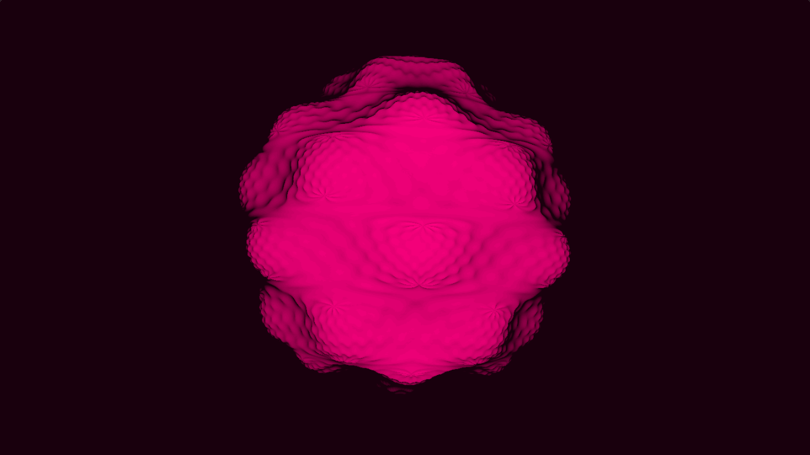

# EasyCL - OpenCL wrapper for easy GPGPU computing
EasyCL - OpenCL wrapper for easy GPGPU computing. Mandelbulb [demo](https://www.shadertoy.com/view/Ms2yDt) at shadertoy.com

## API
```cpp
EasyCL()
    .LoadDevice(0, 0) // Platform and device id
    .LoadSrc("shader.cl")
    .LoadKernel("start")
    .SetArg(arg_id, data, data_size)
    .Run(global_size, local_size)
    .ReadBuffer(arg_id, data, data_size);
```

## Example - mandelbulb ray marcher
Setup OpenCL and SDL2 to run the example.


### main.cpp
```cpp
#include "easycl.hpp"
#include "easysdl.hpp"

int main(int argc, char** argv) {
    auto easysdl = EasySDL()
        .Init()
        .SetWindow(512, 512);
        //.set_window_full_screen();

    auto easycl = EasyCL()
        .LoadDevice(0, 0)
        .LoadSrc("shader.cl")
        .LoadKernel("start")
        .SetArg(0, easysdl.screen_buffer, easysdl.screen_buffer_size)
        .SetArg(1, &easysdl.width)
        .SetArg(2, &easysdl.height)
        .SetArg(3, &easysdl.timer)
        .Run(easysdl.screen_buffer_size)
        .ReadBuffer(0, easysdl.screen_buffer, easysdl.screen_buffer_size);

    while (!easysdl.KeyDown(SDLK_ESCAPE)) {
        easysdl
            .Tick()
            .Render()
            .SetTitle("FPS: " + std::to_string(easysdl.fps));

        easycl
            .UpdateArg(3, &easysdl.timer)
            .Run(easysdl.screen_buffer_size)
            .ReadBuffer(0, easysdl.screen_buffer, easysdl.screen_buffer_size);
    }
    easysdl.Destroy();

    return 0;
}
```

### shader.cl
```cl
#include "marcher.cl"

float3 shade(float2 uv, float time) {
    ray r = calc_ray(uv, time);
    float i = march(r, time);
    return (float3)(0.2, i, i + 0.2);
}

void kernel start(
    global int* screen_buffer,
    constant const int* width,
    constant const int* height,
    constant float* time
) {
    int pixel_id = get_global_id(0);
    float2 pos = (float2)(pixel_id % *width, pixel_id / *width);

    float ar = (float)*width / (float)*height;
    float2 uv = pos / min(*width, *height) - (float2)(ar * 0.5, 0.5);

    float3 fcolor = shade(uv, *time) * 255;
    int icolor = ((int) fcolor.z << 16) + ((int) fcolor.y << 8) + (int) fcolor.x;
    screen_buffer[pixel_id] = icolor;
}
```

### Screenshots



